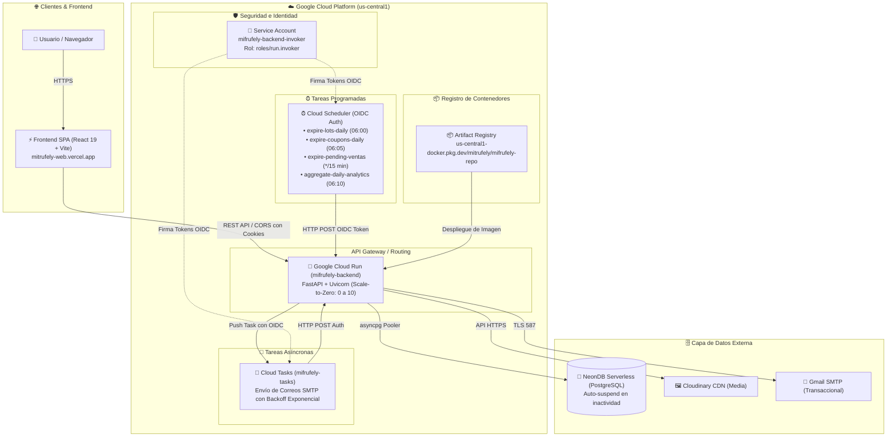

# ☁️ Arquitectura y Despliegue Serverless en Google Cloud Platform (GCP) — MitrufelyWeb

Este documento detalla la arquitectura de producción de **MitrufelyWeb** en **Google Cloud Platform (GCP)**, implementada bajo el paradigma **Serverless Scale-to-Zero**, optimizada para costo $0 en inactividad, alta concurrencia bajo demanda y procesamiento asíncrono desacoplado.

---

## 1. 🏗️ Visión General de la Topología Serverless

El backend y sus servicios auxiliares se encuentran 100% alojados en Google Cloud Platform, orquestados mediante contenedores administrados y servicios nativos de cola y cron:



---

## 2. 🧩 Componentes del Ecosistema GCP

### 2.1. Google Cloud Run (`mifrufely-backend`)
* **Rol:** Servidor de aplicación principal que expone la API RESTful de FastAPI.
* **URL Pública:** `https://mifrufely-backend-zwy2wghfva-uc.a.run.app`
* **Especificaciones de Contenedor:**
  * **Memoria:** 512 MiB
  * **vCPU:** 1
  * **Timeout de Petición:** 60s
  * **Concurrencia por instancia:** 80 peticiones simultáneas.
  * **Escalado:** `min-instances: 0` | `max-instances: 10` (Scale-to-Zero total cuando no hay tráfico).
  * **Ingreso:** `all` (público con control CORS en la capa de aplicación).
  * **Arranque:** Uvicorn corriendo bajo usuario no root (`appuser`).

### 2.2. Google Cloud Tasks (`mifrufely-tasks`)
* **Rol:** Reemplazo serverless de Celery Worker / Redis para el despacho garantizado de correos electrónicos transaccionales (registro, recuperación de contraseña, confirmación de pedidos).
* **Ubicación:** `us-central1`
* **Políticas de Entrega:**
  * **Reintentos:** Hasta 5 intentos con backoff exponencial progresivo (10s a 300s).
  * **Límite de tasa:** 10 despachos por segundo.
  * **Seguridad:** Peticiones HTTP autenticadas contra `/api/v1/tasks/send-email` firmadas con token OIDC por la Service Account `mifrufely-backend-invoker`.

### 2.3. Google Cloud Scheduler (Crons con OIDC)
* **Rol:** Reemplazo serverless de Celery Beat para la ejecución de procesos periódicos de mantenimiento y negocio:

| Nombre del Job | Frecuencia (CRON) | Zona Horaria | Endpoint Objetivo | Descripción |
|---|---|---|---|---|
| `expire-lots-daily` | `0 6 * * *` (06:00 AM) | America/Lima | `POST /api/v1/tasks/expire-lots` | Ejecuta `sp_expirar_lotes_vencidos()` en NeonDB. |
| `expire-coupons-daily` | `5 6 * * *` (06:05 AM) | America/Lima | `POST /api/v1/tasks/expire-coupons` | Inactiva cupones cuya fecha de vigencia haya expirado. |
| `expire-pending-ventas` | `*/15 * * * *` (Cada 15 min) | America/Lima | `POST /api/v1/tasks/expire-pending-ventas` | Libera stock reservado de compras que no concluyeron el pago. |
| `aggregate-daily-analytics` | `10 6 * * *` (06:10 AM) | America/Lima | `POST /api/v1/tasks/aggregate-daily` | Consolida métricas diarias de ventas y KPIs. |

### 2.4. Google Artifact Registry (`mifrufely-repo`)
* **Repositorio:** `us-central1-docker.pkg.dev/mitrufely/mifrufely-repo`
* **Formato:** Docker v2
* **Modo:** Optimizado con `.dockerignore` (reducción de contexto de compilación de 200MB a 4MB).

---

## 3. 🛡️ Capa de Resiliencia y Fallback de Caché

Para permitir el modelo **Scale-to-Zero** sin depender de un clúster de Redis dedicado de alto costo mensual, se diseñó el cliente híbrido `ResilientRedisClient` ([`_backEnd/app/infrastructure/cache/redis_client.py`](file:///c:/Users/lordm/Desktop/Proyectos%20y%20clases/UTP%20CICLO%206/Integrador%20de%20Sistemas/proyecto/MitrufelyWeb/_backEnd/app/infrastructure/cache/redis_client.py)):

```python
# Comportamiento dual transparente:
if settings.APP_ENV == "production" or settings.REDIS_URL.startswith("memory://"):
    # Utiliza almacenamiento en memoria de alto rendimiento con expiración TTL pasiva
    storage = InMemoryFallbackRedis()
else:
    # En desarrollo local (Docker Compose) se conecta a redis://redis:6399
    storage = Redis.from_url(settings.REDIS_URL)
```

### Ventajas:
1. **Rate Limiting (`slowapi`):** Funciona mediante `storage_uri="memory://"` evitando fallos de resolución DNS (`redis:6399`) en Cloud Run.
2. **Blocklist de Tokens JWT & JTI de un solo uso:** Operan de forma atómica y no bloqueante.
3. **Costo Cero:** No requiere Cloud Memorystore ni Redis Enterprise en la nube.

---

## 4. 🔒 Configuración de CORS y Seguridad

En [`_backEnd/app/core/config.py`](file:///c:/Users/lordm/Desktop/Proyectos%20y%20clases/UTP%20CICLO%206/Integrador%20de%20Sistemas/proyecto/MitrufelyWeb/_backEnd/app/core/config.py) y [`_backEnd/gcp/env.yaml`](file:///c:/Users/lordm/Desktop/Proyectos%20y%20clases/UTP%20CICLO%206/Integrador%20de%20Sistemas/proyecto/MitrufelyWeb/_backEnd/gcp/env.yaml) se establecen las políticas estrictas de CORS para habilitar la comunicación entre Vercel y Cloud Run con soporte de credenciales (cookies `httpOnly` para Refresh Token):

```yaml
ALLOWED_ORIGINS: "https://mitrufely-web.vercel.app,http://localhost:5173"
ALLOWED_METHODS: "GET,POST,PUT,PATCH,DELETE,OPTIONS"
ALLOWED_HEADERS: "Authorization,Content-Type,X-Request-ID,Idempotency-Key"
```

* **Validación Resiliente de Pydantic:** Se implementó `@field_validator(mode="before")` con tipo de unión `list[str] | str` para soportar strings separados por coma inyectados por Cloud Run sin disparar errores de `json.loads()`.

---

## 5. 📜 Script de Despliegue Automatizado (`deploy.ps1`)

El despliegue completo se realiza en un solo paso mediante PowerShell ejecutando [`_backEnd/gcp/deploy.ps1`](file:///c:/Users/lordm/Desktop/Proyectos%20y%20clases/UTP%20CICLO%206/Integrador%20de%20Sistemas/proyecto/MitrufelyWeb/_backEnd/gcp/deploy.ps1):

```powershell
# Ejecución del despliegue en GCP
.\_backEnd\gcp\deploy.ps1
```

### Flujo del script:
1. Habilita las APIs necesarias (`run`, `cloudtasks`, `cloudscheduler`, `artifactregistry`, `iam`).
2. Configura y autentica Docker contra `us-central1-docker.pkg.dev`.
3. Compila la imagen multi-stage (`--target production`) y la sube a Artifact Registry.
4. Crea la Service Account `mifrufely-backend-invoker` y le asigna el rol `roles/run.invoker`.
5. Despliega la nueva revisión en Cloud Run inyectando `env.yaml`.
6. Obtiene la URL pública generada y actualiza `CLOUD_RUN_SERVICE_URL`.
7. Crea la cola de Cloud Tasks `mifrufely-tasks`.
8. Configura los 4 jobs de Cloud Scheduler vinculados a la URL y autenticados con OIDC.

---

## 6. 🧪 Guía de Verificación y Monitoreo

### Verificación de Health Check:
```powershell
Invoke-RestMethod -Uri "https://mifrufely-backend-zwy2wghfva-uc.a.run.app/api/v1/health"
# Salida esperada: { "status": "ok", "service": "mifrufely-backend" }
```

### Disparo manual de Cron Job:
```powershell
gcloud scheduler jobs run expire-lots-daily --location=us-central1 --project=mitrufely
```

### Consulta de Logs en Tiempo Real:
```powershell
gcloud logging read 'resource.type="cloud_run_revision" AND resource.labels.service_name="mifrufely-backend"' `
    --project=mitrufely `
    --limit=20 `
    --format="table(timestamp, textPayload, jsonPayload.message)"
```
