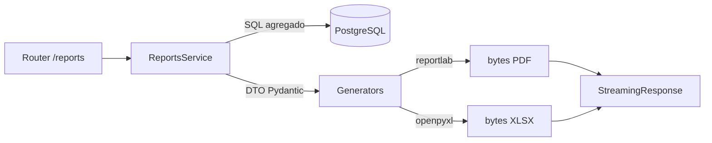

# Fase 7: Reportes, Dashboard Administrativo y Comprobantes Electrónicos

Esta fase convierte la información operativa del sistema (ventas, pedidos, catálogo, inventario, usuarios, comprobantes y fidelización) en **herramientas analíticas y descargables** que permiten al administrador supervisar el negocio, tomar decisiones y emitir respaldos formales de las transacciones.

La generación de reportes se resuelve con una **arquitectura híbrida completa**:
- **Backend (generación en servidor):** los siete reportes funcionales se materializan en `app/modules/reports` con tres modalidades (JSON, PDF, Excel) más el comprobante electrónico por venta. Los PDF se generan con `reportlab` (puro Python, multiplataforma) y los Excel con `openpyxl`.
- **Frontend (descarga + dashboards):** `ReportsPage` consume los endpoints del backend y dispara descargas; el dashboard admin renderiza KPIs y gráficos con `recharts`.

> **Decisión técnica — reportlab sobre WeasyPrint:** el plan original mencionaba WeasyPrint, pero esta librería requiere bindings nativos (GTK2/Pango/Cairo) que no son portables en Windows sin instalar runtimes C adicionales. Se eligió `reportlab` (100 % Python, ya instalado) para garantizar portabilidad y reproducibilidad del build en cualquier entorno. `WeasyPrint` sigue en `requirements.txt` pero no se usa activamente.

## 0. Identificación de Reportes (Especificación de Negocio)

Los reportes cumplen una función importante dentro de la plataforma, ya que permiten **organizar, supervisar y analizar** la información generada por las ventas, pedidos, usuarios y productos, mejorando la toma de decisiones y el control general del negocio.

La fase identifica **siete reportes funcionales**, cada uno con un objetivo de negocio concreto:

| # | Reporte | Dominio | Función principal |
|---|---------|---------|-------------------|
| 1 | **Rendimiento de Ventas** | Económico | Comportamiento de ventas por periodo, productos más vendidos, métodos de pago. |
| 2 | **Seguimiento de Pedidos** | Operativo | Estado de pedidos (pendiente / completado / entregado) y línea de tiempo. |
| 3 | **Catálogo Comercial** | Catálogo | Datos de productos (nombre, categoría, precio, estado) y detección de inactivos. |
| 4 | **Control de Inventario** | Stock | Productos agotados o con bajo stock; planificación de reposición. |
| 5 | **Gestión de Usuarios** | Acceso | Roles, estado de cuentas y actividad de las personas registradas. |
| 6 | **Comprobantes Electrónicos** | Fiscal | Comprobantes digitales en PDF con datos del cliente, productos y total. |
| 7 | **Fidelización SweetCoins / CriptoTrufa** | Marketing | Puntos acumulados, utilizados y próximos a vencer; recompensas. |

Cada reporte cumple una función específica que ayuda tanto a la gestión operativa como a la toma de decisiones dentro de la plataforma.

## 1. Estado de Implementación (post-implementación)

Los **siete reportes están implementados y disponibles** en backend (JSON + PDF + Excel) y, donde corresponde, con pantalla frontend:

| Reporte | Backend (PDF/Excel/JSON) | Frontend |
|---|---|---|
| 1. Rendimiento de Ventas | ✅ `/reports/ventas{,/pdf,/excel}` | ✅ `ReportsPage` (tab ventas) + `AdminDashboardPage` |
| 2. Seguimiento de Pedidos | ✅ `/reports/pedidos{,/pdf,/excel}` | ✅ `OrderTrackingTimeline` + dashboard |
| 3. Catálogo Comercial | ✅ `/reports/catalogo{,/pdf,/excel}` | ✅ `ReportsPage` (tab inventario) + `CatalogAdminPage` |
| 4. Control de Inventario | ✅ `/reports/inventario{,/pdf,/excel}` | ✅ `ReportsPage` (tab inventario/audit) |
| 5. Gestión de Usuarios | ✅ `/reports/usuarios{,/pdf,/excel}` + `/admin/users` | ✅ `AdminUsersPage` (`/dashboard/usuarios`) |
| 6. Comprobantes Electrónicos | ✅ `/reports/ventas/{id}/comprobante.pdf` | ✅ Botón descarga en `CustomerOrderDetailPage` |
| 7. Fidelización SweetCoins | ✅ `/reports/fidelizacion{,/pdf,/excel}` | ✅ `AdminSweetCoinsPage` |

## 2. Arquitectura del Módulo Backend `app/modules/reports`

```
app/modules/reports/
├── __init__.py
├── schemas.py            # DTOs de los 7 reportes (ReporteTipo, Reporte*Response, Reporte*Item)
├── service.py            # ReportsService: consultas agregadas (SQLAlchemy async)
├── dependencies.py       # DI: get_reports_service → ReportsServiceDep
├── router.py             # 4 endpoints: JSON, PDF, Excel + comprobante
└── generators/
    ├── __init__.py
    ├── pdf_generator.py      # reportlab — reportes tabulares (6 tipos)
    ├── pdf_comprobante.py    # reportlab — comprobante de venta (boleta/factura)
    └── excel_generator.py    # openpyxl — reportes tabulares (6 tipos)
```

### Flujo de generación



El `ReportsService` solo **lee y agrega** datos (sin persistir). Cada método retorna un DTO `Reporte*Response` listo para serializar a JSON o pasar a los generadores. Los generadores producen los bytes en memoria (sin tocar disco) y el router los envuelve en `StreamingResponse` con el `Content-Disposition` correcto.

## 3. Backend — Los Siete Reportes (servicio)

`app/modules/reports/service.py` — `ReportsService` con un método por reporte:

| Método | Reporte | Consulta principal |
|---|---|---|
| `reporte_ventas(fecha_desde, fecha_hasta, estado_pago)` | 1 | `Venta` join `Cliente/Usuario/MetodoPago`; totales + ticket promedio |
| `reporte_pedidos(fecha_desde, fecha_hasta, estado)` | 2 | `Venta` con estados FSM; conteo por estado |
| `reporte_catalogo(search)` | 3 | `Producto` join `Categoria`; activos/inactivos |
| `reporte_inventario(solo_bajo_stock)` | 4 | `Producto` con clasificación `DISPONIBLE/BAJO/AGOTADO` + valorización |
| `reporte_usuarios(rol, search)` | 5 | `Usuario` join `Rol` |
| `reporte_fidelizacion()` | 7 | `MovimientoPuntos` agregado por cliente + `CuponCliente` |
| `obtener_venta_para_comprobante(id)` | 6 | Reúne venta + cliente + documento + detalles para el PDF |

## 4. Backend — Generadores PDF y Excel

### 4.1 `generators/pdf_generator.py` (reportlab)
Genera PDFs tabulares en formato A4 horizontal con paleta de marca (vino `#5c0f1b`, acento naranja `#ff7a45`). Cada reporte tiene:
- Encabezado con título + subtítulo descriptivo.
- Tira de **KPIs** (total, ticket promedio, productos agotados, etc.).
- Tabla con cabecera vino, filas alternadas y bordes sutiles.
- Pie de página con fecha de generación y número de página.

`exportar_reporte_a_pdf(reporte_tipo, data) -> bytes` es el punto de entrada único que despacha al reporte adecuado.

### 4.2 `generators/pdf_comprobante.py` (reportlab)
Genera el **comprobante electrónico** por venta en A4 vertical:
- Marca "Mitrufely" + tipo de documento (BOLETA/FACTURA) y número de serie.
- Datos del cliente (nombre, email, teléfono) y fecha de emisión.
- Tabla de productos (cantidad, descripción, precio unitario, subtotal).
- Desglose de totales (subtotal, envío, descuento cupón, base imponible, IGV 18 %) y caja de **TOTAL PAGADO** en vino.
- Pie formal: "Gracias por su compra".

`generar_comprobante_pdf(data: dict) -> bytes` recibe el dict plano de `obtener_venta_para_comprobante`.

### 4.3 `generators/excel_generator.py` (openpyxl)
Genera `.xlsx` con estilos institucionales (cabecera vino, KPIs, filas alternadas). Un workbook por reporte con `exportar_reporte_a_excel(reporte_tipo, data) -> bytes`.

## 5. Backend — Router y Endpoints

`app/modules/reports/router.py` — prefix `/reports`. Permisos: `REPORT_GENERATE` + `AdminUser`.

| Método | Ruta | Descripción |
|---|---|---|
| `GET` | `/reports/{tipo}` | Reporte en JSON (`tipo` ∈ ventas, pedidos, catalogo, inventario, usuarios, fidelizacion) |
| `GET` | `/reports/{tipo}/pdf` | Descarga PDF (reportlab, en memoria) |
| `GET` | `/reports/{tipo}/excel` | Descarga Excel (openpyxl, en memoria) |
| `GET` | `/reports/ventas/{id_venta}/comprobante.pdf` | Comprobante electrónico PDF de una venta |

Filtros vía query params: `fecha_desde`, `fecha_hasta`, `estado`, `estado_pago`, `search`. Las descargas usan `StreamingResponse` con `Content-Disposition: attachment`.

## 6. Backend — Módulo `app/modules/users`

Reporte de Gestión de Usuarios completo:

```
app/modules/users/
├── schemas.py          # UserListItemResponse, UserDetailResponse, UserEstadoUpdateRequest
├── service.py          # UsersService: list_users, get_user_detail, update_user_estado
├── dependencies.py     # DI: get_users_service → UsersServiceDep
└── router.py           # prefix /admin/users
```

| Método | Ruta | Permiso | Descripción |
|---|---|---|---|
| `GET` | `/admin/users` | `USER_READ_ALL` + AdminUser | Listado con rol, estado, total ventas, última actividad |
| `GET` | `/admin/users/{id}` | `USER_READ_ALL` | Detalle (incluye datos fiscales) |
| `PATCH` | `/admin/users/{id}/estado` | `USER_UPDATE` | Activar/desactivar cuenta (borrado lógico) |

La consulta `list_users` une `usuarios` con `roles`/`clientes` y agrega subconsultas de total de ventas y última actividad (`logs_sistema`).

## 7. Backend — Tareas Celery

`app/infrastructure/workers/tasks/reports.py` — generación asíncrona para reportes pesados (patrón `asyncio.run` + `AsyncSessionFactory` del proyecto):

| Tarea | Nombre Celery | Acción |
|---|---|---|
| `generate_sales_pdf` | `app.infrastructure.workers.tasks.reports.generate_sales_pdf` | Genera PDF de cualquier reporte en background |
| `export_inventory_excel` | `app.infrastructure.workers.tasks.reports.export_inventory_excel` | Genera Excel de cualquier reporte en background |

Ambas son genéricas (`report_params = {"tipo": ..., "filtros": {...}}`) y reutilizan `ReportsService` + los generadores. Mantienen los nombres históricos del `beat_schedule`.

## 8. Backend — Dashboard (KPIs en vivo)

```
app/modules/dashboard/
├── router.py     # GET /admin/dashboard/metrics (AdminUser)
├── service.py    # DashboardService.get_metrics()
└── schemas.py    # DashboardMetricsResponse
```

`DashboardService.get_metrics()` (`service.py:30`) calcula en una sola invocación: conteo por estado de venta, totales financieros, ticket promedio, tiempo promedio de entrega, top 10 productos, ventas por día (30 días), calificaciones e incidencias abiertas.

## 9. Frontend — Componentes Clave

| Archivo | Responsabilidad |
|---|---|
| `_frontEnd/src/features/reports/api/reports.api.ts` | `reportsApi` (getReporte, descargarPdf, descargarExcel, descargarComprobante) + helper `descargarBlob` |
| `_frontEnd/src/features/reports/types.ts` | Espejo TS de los DTOs Pydantic |
| `_frontEnd/src/features/reports/pages/ReportsPage.tsx` | Página de reportes: 3 tabs client-side + botones "PDF Servidor"/"Excel Servidor" (descarga del backend) |
| `_frontEnd/src/features/users/api/users.api.ts` | `usersApi` (listar, detalle, actualizarEstado) |
| `_frontEnd/src/features/users/hooks/useUsers.ts` | `useUsersQuery` + `useToggleUserEstadoMutation` (TanStack Query) |
| `_frontEnd/src/features/users/pages/AdminUsersPage.tsx` | `/dashboard/usuarios`: tabla filtrable, KPIs, modal detalle, toggle estado, export PDF/Excel |
| `_frontEnd/src/features/dashboard/pages/AdminDashboardPage.tsx` | KPIs + gráficos recharts (AreaChart ingresos, BarChart top productos) |
| `_frontEnd/src/features/orders/pages/CustomerOrderDetailPage.tsx` | Botón "Descargar comprobante PDF" en la sección de documentos |

### Rutas y permisos (router.tsx)
- `/dashboard/usuarios` → `AdminUsersPage` protegida por `MANAGE_USERS` (solo ADMIN).
- `/reports` → `ReportsPage` protegida por `VIEW_REPORTS`.
- Sidebar `AdminLayout.tsx`: entrada "Usuarios" con icono `Users`.

## 10. Seguridad y Permisos (RBAC)

| Permiso | Roles | Uso |
|---|---|---|
| `REPORT_GENERATE` (backend) | ADMIN (vía `require_permission`) | Reports router (JSON/PDF/Excel + comprobante) |
| `USER_READ_ALL` / `USER_UPDATE` (backend) | ADMIN | Users router |
| `VIEW_REPORTS` (frontend) | ADMIN, MANAGER | Ruta `/reports` |
| `MANAGE_USERS` (frontend) | ADMIN | Ruta `/dashboard/usuarios` |
| `EXPORT_REPORTS` (frontend) | ADMIN, MANAGER | Definido (las exportaciones van vía `/reports`) |

## 11. Dependencias con Otras Fases

- **Fase 2 (Catálogo):** datos de productos/categorías para Catálogo e Inventario.
- **Fase 3 (Inventario FEFO):** clasificación de stock y valorización.
- **Fase 4 (Checkout):** el `Documento` generado en la transacción alimenta el comprobante PDF.
- **Fase 5 (Pedidos):** FSM, `order_events` y conteo por estado alimentan dashboard y seguimiento.
- **Fase 6 (CriptoTrufas):** `MovimientoPuntos` y `CuponCliente` alimentan el reporte de fidelización.

## 12. Auditoría de Implementación

Verificada al cierre de la fase:

| Verificación | Resultado |
|---|---|
| Compilación Python (sintaxis) de los 12 archivos nuevos/modificados | ✅ OK |
| Imports del backend (`from app.main import app`) | ✅ 100 rutas registradas |
| Generación PDF (reportlab) con datos sintéticos | ✅ Header `%PDF`, 2.3–3.1 KB |
| Generación Excel (openpyxl) con datos sintéticos | ✅ Header `PK`, 5.5 KB |
| Generación comprobante PDF | ✅ Header `%PDF`, 3.1 KB |
| Endpoints nuevos devuelven 401 sin auth (no 404/500) | ✅ `/admin/users`, `/reports/*`, comprobante |
| Suite de pruebas backend (`pytest`) | ✅ **146 passed, 0 failed** |
| `tsc --noEmit` del frontend | ✅ Sin errores |
| `npm run build` del frontend | ✅ Built en 23.9 s |

---
**Estado de la Fase**: ✅ **Implementada y auditada**. Los siete reportes funcionales están disponibles en backend (JSON + PDF + Excel) con generación en servidor vía `reportlab` y `openpyxl`, comprobantes electrónicos PDF por venta, módulo de gestión de usuarios completo, tareas Celery asíncronas y pantallas frontend integradas (AdminUsersPage, descargas en ReportsPage, comprobante en CustomerOrderDetailPage).
